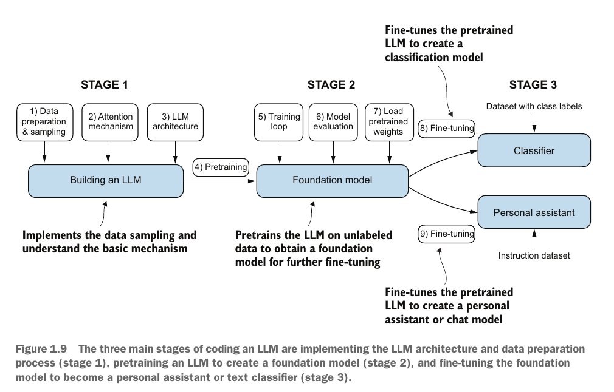

<div align="center">

# 🚀 LLM From Scratch


A step-by-step guide to implement a GPT-like Large Language Model from scratch using PyTorch. The project breaks down everything from tokens and dataset preparation, up to training causal self-attention mechanisms and generating synthetic text.

<br />



</div>

<br />

## ✨ Features

- **Text Data Processing** — Implemented Byte Pair Encoding (BPE), sliding window context, and tokenization from scratch.
- **Attention Mechanisms** — Built unweighted, weighted, causal, and multi-head self-attention techniques.
- **GPT Architecture** — Designed Transformer Blocks, shortcut connections, feed-forward networks (GeLU), and layered normalization.
- **Pretraining & Generation** — Implemented decoding strategy scripts, validation steps, model pretraining loops, and text evaluation logic.

## 🛠️ Tech Stack

| Layer | Technology |
|-------|-----------|
| **Framework** | PyTorch >= 2.3.0 |
| **Language** | Python 3.10+ |
| **Environment** | JupyterLab >= 4.0 |
| **Tokenization** | Tiktoken >= 0.5.1 |
| **Data Sci** | NumPy, Pandas, Matplotlib, TensorFlow |
| **Dependencies** | uv / `pyproject.toml` |

## 📦 Installation

Ensure you have Python 3.10+ installed.

1. **Clone the Repository**
    ```bash
    git clone https://github.com/itxmjr/LLM-From-Scratch.git
    cd LLM-From-Scratch
    ```

2. **Install Dependencies**
    You can use standard pip or `uv` to install the requirements from `pyproject.toml`.
    ```bash
    # Using uv (recommended)
    uv sync
    # Or using standard pip
    pip install -e .
    ```

3. **Run the Jupyter Environment**
    ```bash
    jupyter lab
    ```

## 🎮 Usage

Launch JupyterLab and proceed chronologically through the topic directories, which contain incremental notebooks outlining the architectural growth of a GPT model:

1. **Chapter 2:** `Ch02_Working_With_Text_Data/` — Focuses on data preparation, BPE tokenization, and vector embeddings.
2. **Chapter 3:** `Ch03_Coding_Attention_Mechanism/` — Implements the mathematical backbone of transformer layers (self and causal attention).
3. **Chapter 4:** `Ch04_Implementing_A_GPT_Model/` — Wraps the self-attention into full structural Transformer capabilities.
4. **Chapter 5:** `Ch05_Pretraining_On_Unlabeled_Data/` — Shows how to train the assembled models and evaluate generated output.

## 📂 Project Structure

```text
llm-from-scratch/
├── Ch02_Working_With_Text_Data/
├── Ch03_Coding_Attention_Mechanism/
├── Ch04_Implementing_A_GPT_Model/
├── Ch05_Pretraining_On_Unlabeled_Data/
├── assets/
├── pyproject.toml
├── uv.lock
└── README.md
```

## 🤝 Contributing

Contributions are welcome! If you have suggestions for improvements or new features, feel free to open an issue or submit a pull request.

1. Fork the repository.
2. Create your feature branch (`git checkout -b feature/AmazingFeature`).
3. Commit your changes (`git commit -m 'Add some AmazingFeature'`).
4. Push to the branch (`git push origin feature/AmazingFeature`).
5. Open a Pull Request.

## 📜 License

This project is licensed under the MIT License — see the [LICENSE](LICENSE) file for details.

---

## 🌐 Connect

<div align="center">

<a href="https://mjawad.tech"></a>
<a href="https://linkedin.com/in/itxmjr"></a>
<a href="https://github.com/itxmjr"></a>
<a href="https://youtube.com/@aibymjr"></a>
<a href="https://www.fiverr.com/aibymjr"></a>
<a href="https://www.upwork.com/freelancers/~011c75cbed1d1a6c4b"></a>

<sub>Built with ❤️ by M Jawad ur Rehman.</sub>

</div>
